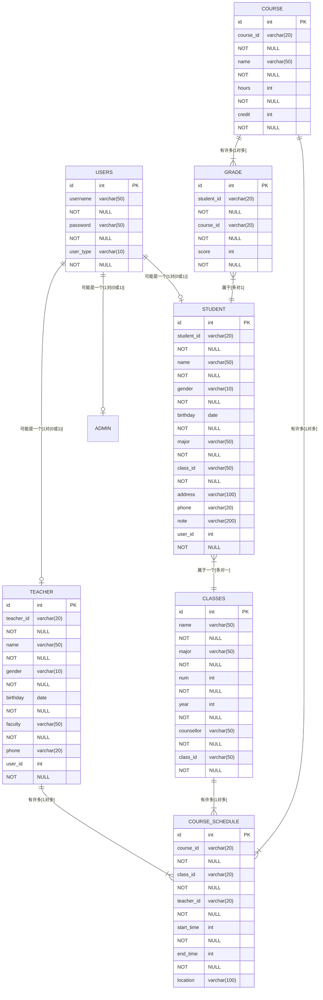

# **课程设计报告**

> 教学单位 *计算机与信息科学学院*
>
> 课程名称  J2EE程序设计
>
> 专业名称 *计算机科学与技术*
>
> 项目名称 教务管理系统
>
> 项目组组长  *020301700164王宇哲*
>
> 项目组成员1  *020301700131赵英杰*
>
> 项目组成员2  *020301700020李佳倩*
>
> 指导教师       *吴先飞*

**2023年 6月 9日**


# 一、绪论

## 1.1 背景

在当代社会，随着高等教育的快速普及，大学生的数量逐年攀升。这意味着，越来越多的学校需要面对更多的学生和教师，而教务管理工作也变得日益复杂和繁琐。

并且，在传统的教务管理中，学校教务人员需要进行大量的手工操作，如班级排课、学生选课、成绩管理等，这些工作不仅占用时间和人力资源，而且容易出现错误和疏漏。同时，对于学生和教师来说，查询个人信息和课程安排也需要耗费时间和精力。

## 1.2 设计目的

教务管理系统的出现就是为了解决以上问题。通过互联网技术，可以将教务管理各个环节的工作流程联通起来，实现信息共享、自动化处理和在线查询等功能，从而提高教务管理的效率和质量。具体而言，它可以实现以下目标：

1. **提高教务工作效率**：通过自动化处理代替手工操作，减少教务管理的时间和人力成本。
2. **提高学生教育质量**：及时、准确地为学生提供个性化服务，提高教学质量。
3. **加强沟通和协作**：促进学生、教师和教务人员之间的沟通和协作，增进彼此之间的了解和信任。
4. **保障教务信息安全**：通过身份认证、数据加密、访问权限和安全日志等功能，提高教务信息的安全性。

这些系统可以自动化地完成排课、选课、成绩管理等教务工作流程，减少人工操作和出错率。同时，教务管理系统也为学生和教师提供了更便捷的查询服务，轻松地获取个人信息和课程信息。

因此，教务管理系统不仅可以提高教务管理效率和教学质量，也能为学生和教师提供更好的服务和体验。可以预见，随着教务管理系统技术的不断进步和完善，其应用范围和需求将越来越广泛和迫切。

故，本文所设计的教务管理系统是一款基于Spring Boot、MySQL、Vue和MyBatis等技术栈开发的信息管理系统。其中，Spring Boot作为后台框架，提供了高效的业务逻辑处理和数据交互能力；MySQL作为数据库，存储和管理系统的数据；Vue作为前端框架，实现了良好的用户界面和交互体验；MyBatis则作为持久层框架，实现了数据访问和交互操作。


# 二、 需求分析

> `考核要求：`遵循Java Web应用系统的分层模型与面向接口编程的基本思想,应用SSM框架，开发一个教务管理系统。


### **2.1 系统功能要求**

系统信息包括：

> 用户信息（用户名，密码，用户类别）
>
> 学生基本信息（学号，姓名，性别，出生日期，专业，班级，家庭住址，联系电话，备注）
>
> 班级基本信息（班级名称，专业，班级人数，入学年份，辅导员）
>
> 课程信息（课程号，课程名，学时，学分）
>
> 课程表信息（排课ID，课程号，班级号，授课教师，授课时间，授课地点）
>
> 成绩表（学号，课程号，分数）
>
> 教师表（工号，姓名，性别，出生日期，院系，联系电话）


[^用户]: 学生、教师和管理员3种类型

------

#### 2.1.1 **学生功能**

- [x] 查询自己基本信息


- [x] 查询自己班级基本信息


- [x] 查询课程信息


- [x] 查询自己班级课程表信息


- [x] 查询自己的成绩信息


- [x] 对自己的登录密码进行修改。

  

#### **2.1.2 教师功能**

- [x] 查询教师自己的基本信息
- [x] 查询自己的课程表信息
- [x] 查询自己授课的课程的成绩信息
- [x] 提交自己教授课程的成绩


#### 2.1.3 **管理员功能**

- [x] 用户管理、学生信息管理、班级信息管理、课程信息管理、课程表信息管理、成绩信息管理：对所有信息进行添加、删除、修改、查询。
- [x] 成绩分析


> 管理员能查询所有表的所有信息，也能根据搜索框提交的关键字搜索对应信息。

#### 2.1.4 查询功能

**学生基本信息查询：**

- [x] 根据学号查询、姓名查询某个学生信息
- [x] 根据专业、班级查询某个专业、班级所有学生信息。

**班级基本信息查询：**

- [x] 根据班级名称查询、根据专业查询、根据入学年份查找班级信息。

**课程信息查询：**

- [x] 根据课程号、课程名查询课程信息。

**课表信息查询：**

- [x] 根据课程号、课程名查询、教师进行查询、能根据时间进行查询。

**成绩查询：**

- [x] 按照学号查询某个学生的全部成绩

- [x] 根据课程号查询某门课程的成绩
- [x] 能按照成绩区间查找成绩，比如说查询不及格的学生或者90分以上的学生及课程。

#### 2.1.5 排课控制

**排课控制：**

一名教师不能同时给两个班级上课，一个班不能同时上两门课，一个教室不能同时排两门课


### 2.2 技术可行性需求分析

#### **2.2.1 前端技术选型**

本系统的前端采用Vue框架进行开发，Vue是一款轻量级开源JavaScript框架，它采用MVVM（Model-View-ViewModel）模式，具有简单易用、渐进式、高效灵活等特点。在教务管理系统的前端技术选型中，使用Vue框架可以提高开发效率和用户体验。

#### **2.2.2 后端技术选型**

本系统的后端采用Spring Boot三层框架进行开发，Spring Boot是一个为快速开发而设计的Spring微框架，封装了常见的配置和构建方式，简化了Spring应用的开发流程，加快了开发速度。同时，本系统的数据存储采用MySQL作为关系型数据库，Redis作为缓存数据库，以保证系统的高可用性和稳定性。

#### **2.2.3 系统可扩展性**

本系统的前端采用Vue框架进行开发，可以轻松地将应用程序移植到各个主要操作系统平台，具有较好的可扩展性；同时，后端采用Spring Boot三层框架进行开发，结合MySQL和MyBatis等关键技术，可以轻松地进行扩展和部署，以适应不断变化的业务需求。

并且还考虑了以下三个方面：

>模块化设计：在设计系统时，应该考虑将系统划分为若干个模块，每个模块功能独立，易于扩展和维护。
>
>松耦合架构：系统应该采用松耦合的架构，各个模块之间的耦合度应该尽量降低，以便于后期的扩展和修改。
>
>面向接口编程：系统应该采用面向接口编程的方式，这样可以使得系统具有更好的灵活性和可扩展性。


# 三、系统设计

## 3.1 系统模块设计

该系统包含了学生管理、教师管理和管理员管理三个主要模块。

- 学生模块

  - 查询自己的基本信息、班级基本信息、课程信息、班级课程表信息和成绩信息

  - 修改登录密码

    ```mermaid
    graph LR;
      B(学生管理);
      B-->E(查询自己基本信息);
      B-->F(查询班级基本信息);
      B-->G(查询课程信息);
      B-->H(查询班级课程表信息);
      B-->I(查询成绩信息);
    
    ```

    

- 教师模块

  - 查询自己的基本信息、课程表信息、授课成绩信息

  - 提交自己教授课程的成绩

    ```mermaid
    graph LR
      C(教师管理);
      C-->K(查询自己基本信息);
      C-->L(查询课程表信息);
      C-->M(查询自己授课的课程的成绩信息);
      C-->N(提交自己教授课程的成绩);
    
    ```

    

- 管理员模块

  -  用户管理：添加、删除、修改和查询用户信息

  - 课程管理：添加、删除、修改和查询课程信息
  - 班级管理：添加、删除、修改和查询班级信息
  - 成绩管理：添加、删除、修改和查询成绩信息
  - 成绩分析：结合AI，可对学生成绩进行分析建议
  - 排课管理：添加、删除、修改和查询课表信息

  ```mermaid
  graph LR
    D(管理员管理);
    D-->O(用户管理);
    D-->P(班级管理);
    D-->Q(课程管理);
    D-->R(课表管理);
    D-->S(成绩管理);
    D-->H(成绩分析);
    O-->T(添加用户);
    O-->U(删除用户);
    O-->V(修改用户);
    O-->W(查询用户信息);
    P-->X(添加班级);
    P-->Y(删除班级);
    P-->Z(修改班级信息);
    P-->AA(查询班级信息);
    Q-->AB(添加课程);
    Q-->AC(删除课程);
    Q-->AD(修改课程信息);
    Q-->AE(查询课程信息);
    R-->AF(添加课表);
    R-->AG(删除课表);
    R-->AH(修改课表信息);
    R-->AI(查询课表信息);
    S-->AJ(添加成绩);
    S-->AK(删除成绩);
    S-->AL(修改成绩信息);
    S-->AM(查询成绩信息);
  
  ```

  


## 3.2 数据库设计

### 3.2.1 数据库表结构

[^数据库]: 本系统采用mysql数据库

**用户表(users)**

| 字段名称      | 字段类型    | 长度  | 是否主键 | 是否允许为空 | 备注                                   |
|-----------|---------|-----|------|--------|--------------------------------------|
| id        | int     |     | 是    | 否      |                                      |
| username  | varchar | 50  | 否    | 否      |                                      |
| password  | varchar | 50  | 否    | 否      |                                      |
| user_type | varchar | 10  | 否    | 否      | admin 表示管理员，teacher 表示老师，student表示学生 |

**学生基本信息表(student)**

| 字段名称       | 字段类型    | 长度  | 是否主键 | 是否允许为空 |
|------------|---------|-----|------|--------|
| id         | int     |     | 是    | 否      |
| student_id | varchar | 20  | 否    | 否      |
| name       | varchar | 50  | 否    | 否      |
| gender     | varchar | 10  | 否    | 否      |
| birthday   | date    |     | 否    | 否      |
| major      | varchar | 50  | 否    | 否      |
| class_id   | varchar | 50  | 否    | 否      |
| address    | varchar | 100 | 否    | 是      |
| phone      | varchar | 20  | 否    | 是      |
| note       | varchar | 200 | 否    | 是      |
| user_id    | int     |     | 否    | 否      |

**班级基本信息表(classes)**

| 字段名称       | 字段类型    | 长度  | 是否主键 | 是否允许为空 | 备注    |
|------------|---------|-----|------|--------|-------|
| id         | int     |     | 是    | 否      |       |
| name       | varchar | 50  | 否    | 否      |       |
| major      | varchar | 50  | 否    | 否      |       |
| num        | int     |     | 否    | 否      |       |
| year       | int     |     | 否    | 否      |       |
| counsellor | varchar | 50  | 否    | 否      | 辅导员名称 |
| class_id   | varchar | 50  | 否    | 否      | 班级id  |
**课程信息表(course)**

| 字段名称      | 字段类型    | 长度  | 是否主键 | 是否允许为空 |
|-----------|---------|-----|------|--------|
| id        | int     |     | 是    | 否      |
| course_id | varchar | 20  | 否    | 否      |
| name      | varchar | 50  | 否    | 否      |
| hours     | int     |     | 否    | 否      |
| credit    | int     |     | 否    | 否      |

**课程表信息表(course_schedule)**

| 字段名称       | 字段类型     | 长度  | 是否主键 | 是否允许为空 | 备注        |
|------------|----------|-----|------|--------|-----------|
| id         | int      |     | 是    | 否      |           |
| course_id  | varchar  | 20  | 否    | 否      |           |
| class_id   | varchar  | 20  | 否    | 否      |           |
| teacher_id | varchar  | 20  | 否    | 否      | 教师的id（外键） |
| time       | datetime |     | 否    | 否      |           |
| location   | varchar  | 100 | 否    | 是      |           |

**成绩表(grade)**

| 字段名称       | 字段类型    | 长度  | 是否主键 | 是否允许为空 |
|------------|---------|-----|------|--------|
| id         | int     |     | 是    | 否      |
| student_id | varchar | 20  | 否    | 否      |
| course_id  | varchar | 20  | 否    | 否      |
| score      | int     |     | 否    | 否      |

**教师表(teacher)**

| 字段名称       | 字段类型    | 长度  | 是否主键 | 是否允许为空 | 备注  |
|------------|---------|-----|------|--------|-----|
| id         | int     |     | 是    | 否      |     |
| teacher_id | varchar | 20  | 否    | 否      |     |   
| name       | varchar | 50  | 否    | 否      |     |   
| gender     | varchar | 10  | 否    | 否      |     |   
| birthday   | date    |     | 否    | 否      |     |   
| faculty    | varchar | 50  | 否    | 否      |     |   
| phone      | varchar | 20  | 否    | 是      |     |   
| user_id    | int     |     | 否    | 否      |     |   

> 管理员没有任何信息表
>
> 学生需要将users表关联到student表
>
> 老师需要将users表关联到teacher表


### 3.2.2 **ER图**

本 ER 图中包括了教师、学生、用户、班级、课程、课程表和成绩等实体以及它们之间的关系。

- `USERS` 实体用于保存系统的所有用户信息，包括教师、学生和管理员。每个用户都有一个唯一的 `id` 标识符，用于在其他实体中引用该用户。`user_type` 属性指示该用户类型，可以是教师、学生或管理员。
- `TEACHER` 实体用于保存教师的基本信息，包括工号、姓名、性别、出生日期、所属院系、电话号码等。每个教师也有一个唯一的 `id` 标识符，以及与其对应的 `USERS.id` 标识符表示该教师的用户账号。
- `STUDENT` 实体用于保存学生的基本信息，包括学号、姓名、性别、出生日期、专业、班级、家庭地址、电话号码等。每个学生也有一个唯一的 `id` 标识符，以及与其对应的 `USERS.id` 标识符表示该学生的用户账号。
- `CLASSES` 实体用于保存班级的基本信息，包括名称、所属专业、班级人数、年级、辅导员姓名、班级编号等。每个班级也有一个唯一的 `id` 标识符，其 `class_id` 属性与学生实体中的 `class_id` 属性对应。
- `COURSE` 实体用于保存课程的基本信息，包括课程编号、名称、学时和学分等。每个课程也有一个唯一的 `id` 标识符。
- `COURSE_SCHEDULE` 实体用于保存课程表的相关信息，包括课程编号、班级编号、教师编号、上课开始时间和结束时间、上课地点等。一个课程可以在多个班级中开设，一个班级也可以上多个课程，每个教师可以授课多个课程，因此 `COURSE_SCHEDULE` 实体与 `TEACHER`、`CLASSES` 和 `COURSE` 实体都有关联关系。
- `GRADE` 实体用于保存学生成绩的相关信息，包括学生编号、课程编号和成绩等。一个学生可以选择多门课程，每门课程也有多个学生选修，所以 `GRADE` 实体与 `STUDENT` 和 `COURSE` 实体都有关联关系。

此外，还可以通过 ER 图中的关系来进一步理解各实体之间的关系：

- `USERS` 实体与 `TEACHER`、`STUDENT` 和 `ADMIN` 实体都有关系，表示一个用户账号可能是一个教师、学生或管理员。
- `TEACHER` 实体与 `COURSE_SCHEDULE` 实体之间有关系，表示一个教师可以授课多门课程。
- `STUDENT` 实体与 `CLASSES`、`GRADE` 实体之间有关系，表示一个学生属于一个班级，选择多门课程并获得多门成绩。
- `CLASSES` 实体与 `COURSE_SCHEDULE` 实体之间有关系，表示一个班级可以上多门课程。
- `COURSE` 实体与 `COURSE_SCHEDULE` 和 `GRADE` 实体之间有关系，表示一门课程可以在多个班级中开设，由多个教师授课，并且有多个学生选修并获得成绩。




# 四、系统实现（部分代码及运行界面）

## 4.1 学生模块

### 4.1.1 登录界面（学生）

> 本次选用学生用户名和密码如下：

| 用户名   | 密码   |
| -------- | ------ |
| student1 | 123456 |


```java
//----------登录检测功能（后端）----------
public class StudentControllerAspect {

    @Autowired
    HttpServletRequest request;

    /**
     * 检测是否为学生
     */
    @Before("execution(* com.management.controller.StudentController.*(..))")
    public void checkAdmin() {

        Users users = (Users) request.getSession().getAttribute("user");


        if (users == null) {
            throw new RuntimeException("未登录");
        }


        if (!users.getUserType().equals("student")) {
            throw new RuntimeException("权限不足");
        }

    }
}

```

### 4.1.2 查询界面(学生)

> 可查询学生个人信息、课程表、选课信息


```java
//----------查询功能（后端）----------
    @Operation(summary = "学生查看自己的信息")
    @ApiResponses(value = {
            @ApiResponse(responseCode = "200",description = "成功"),
            @ApiResponse(responseCode = "401",description = "未登录")
    })
    @RequestMapping( value = "/info",produces = "application/json;charset=utf-8",method = RequestMethod.GET)
    public ResultCommon<Users> info(){
        Users user = (Users) request.getSession().getAttribute("user");
        if (user == null){
            return new ResultCommon<>(401,"未登录",null);
        }

        //获取当前用户班级信息
        Classes classes = studentService.getClasses(user);

        user.getStudentInfo().setClasses(classes);

        return new ResultCommon<>(200,"成功", user);
    }

    @Operation(summary = "学生查看自己班级基本信息")
    @ApiResponses(value = {
            @ApiResponse(responseCode = "200",description = "成功"),
            @ApiResponse(responseCode = "401",description = "未登录")
    })
    @RequestMapping( value = "/classInfo",produces = "application/json;charset=utf-8",method = RequestMethod.GET)
    public ResultCommon<Classes> classInfo(){
        Users user = (Users) request.getSession().getAttribute("user");
        if (user == null){
            return new ResultCommon<>(401,"未登录",null);
        }


        //获取当前用户班级信息
        Classes classes = studentService.getClasses(user);

        Student student = user.getStudentInfo();
        student.setClasses(classes);

        user.setStudentInfo(student);

        request.getSession().setAttribute("user",user);

        return new ResultCommon<>(200,"成功", classes);
    }

    @Operation(summary = "学生查看自己课程信息")
    @ApiResponses(value = {
            @ApiResponse(responseCode = "200",description = "成功"),
            @ApiResponse(responseCode = "401",description = "未登录")
    })
    @RequestMapping( value = "/courseInfo",produces = "application/json;charset=utf-8",method = RequestMethod.GET)
    public ResultCommon<List<Course>> courseInfo() {
        Users user = (Users) request.getSession().getAttribute("user");
        if (user == null) {
            return new ResultCommon<>(401, "未登录", null);
        }

        List<Course> courseList = studentService.getCourses(user);

        return new ResultCommon<>(200, "成功", courseList);

    }

    @Operation(summary = "学生查看自己课程表信息")
    @ApiResponses(value = {
            @ApiResponse(responseCode = "200",description = "成功"),
            @ApiResponse(responseCode = "401",description = "未登录")
    })
    @RequestMapping( value = "/courseScheduleInfo",produces = "application/json;charset=utf-8",method = RequestMethod.GET)
    public ResultCommon<List<CourseSchedule>> courseScheduleInfo() {
        Users user = (Users) request.getSession().getAttribute("user");
        if (user == null) {
            return new ResultCommon<>(401, "未登录", null);
        }

        List<CourseSchedule> courseScheduleList = studentService.getCourseSchedule(user);

        return new ResultCommon<>(200, "成功", courseScheduleList);

    }

    @Operation(summary = "学生查看自己的成绩信息")
    @ApiResponses(value = {
            @ApiResponse(responseCode = "200",description = "成功"),
            @ApiResponse(responseCode = "401",description = "未登录")
    })
    @RequestMapping( value = "/scoreInfo",produces = "application/json;charset=utf-8",method = RequestMethod.GET)
    public ResultCommon<List<Grade>> scoreInfo() {
        Users user = (Users) request.getSession().getAttribute("user");
        if (user == null) {
            return new ResultCommon<>(401, "未登录", null);
        }

        List<Grade> scoreList = studentService.getGrades(user.getId());

        return new ResultCommon<>(200, "成功", scoreList);

    }

```

### 4.1.3 修改密码界面

```java
//----------修改功能（后端）----------
    @Operation(summary = "修改登录密码")
    @ApiResponses(value = {
            @ApiResponse(responseCode = "200",description = "成功"),
            @ApiResponse(responseCode = "401",description = "未登录"),
            @ApiResponse(responseCode = "402",description = "原密码错误"),
            @ApiResponse(responseCode = "403",description = "修改失败")
    })
    @RequestMapping( value = "/updatePassword",produces = "application/json;charset=utf-8",method = RequestMethod.POST)
    public ResultCommon<String> updatePassword(
            @Parameter(description = "原密码", required = true) @RequestParam String oldPassword,
            @Parameter(description = "新密码", required = true) @RequestParam String newPassword
    ) {
        Users user = (Users) request.getSession().getAttribute("user");
        if (user == null) {
            return new ResultCommon<>(401, "未登录", null);
        }

        if (!user.getPassword().equals(oldPassword)){
            return new ResultCommon<>(402, "原密码错误", null);
        }

        user.setPassword(newPassword);


        int result  = usersService.updatePassword(user);


        if (result == 0){
            return new ResultCommon<>(403, "修改失败", null);
        }

        return new ResultCommon<>(200, "成功", null);

    }
```


## 4.2 教师模块

### 4.2.1 登录界面（教师）

> 本次选用教师用户名和密码如下：

| 用户名   | 密码     |
| -------- | -------- |
| teacher1 | teacher1 |


```java
public class TeacherControllerAspect {
    @Autowired
    HttpServletRequest request;

    /**
     * 检测是否为老师
     */
    @Before("execution(* com.management.controller.TeacherController.*(..))")
    public void checkAdmin() {

        Users users = (Users) request.getSession().getAttribute("user");

        if (users == null) {
            throw new RuntimeException("未登录");
        }


        if (!users.getUserType().equals("teacher")) {
            throw new RuntimeException("权限不足");
        }
    }
}
```


### 4.2.2 查询界面（教师）

> 可查询教师信息、教师课表、所授课班成绩


```java
//----教师查询功能部分代码（后端）----
    @Operation(summary = "教师查看自己的信息")
    @ApiResponses(value = {
            @ApiResponse(responseCode = "200", description = "成功"),
            @ApiResponse(responseCode = "401", description = "未登录")
    })
    @GetMapping(value = "/info", produces = "application/json")
    public ResultCommon<Users> info() {

        Users user = (Users) request.getSession().getAttribute("user");
        if (user == null) {
            return new ResultCommon<>(401, "未登录", null);
        }
        return new ResultCommon<>(200, "成功", user);
    }

    @Operation(summary = "教师查看自己课程信息")
    @ApiResponses(value = {
            @ApiResponse(responseCode = "200", description = "成功"),
            @ApiResponse(responseCode = "401", description = "未登录")
    })
    @GetMapping(value = "/courseInfo", produces = "application/json;charset=utf-8")
    public ResultCommon<List<Course>> courseInfo() {
        Users user = (Users) request.getSession().getAttribute("user");
        if (user == null) {
            return new ResultCommon<>(401, "未登录", null);
        }

        List<Course> courseList = teacherService.getCourses(user.getTeacherInfo().getTeacherId());

        return new ResultCommon<>(200, "成功", courseList);

    }

    @Operation(summary = "教师查看自己课程的课表信息")
    @ApiResponses(value = {
            @ApiResponse(responseCode = "200", description = "成功"),
            @ApiResponse(responseCode = "401", description = "未登录")
    })
    @GetMapping(value = "/courseScheduleInfo", produces = "application/json;charset=utf-8")
    public ResultCommon<List<CourseSchedule>> courseScheduleInfo() {
        Users user = (Users) request.getSession().getAttribute("user");
        if (user == null) {
            return new ResultCommon<>(401, "未登录", null);
        }

        CourseSchedule courseSchedule = new CourseSchedule();
        courseSchedule.setTeacher(user.getTeacherInfo());

        List<CourseSchedule> courseScheduleList = courseScheduleService.getCourseSchedule(courseSchedule, "teacher");

        return new ResultCommon<>(200, "成功", courseScheduleList);

    }

    @Operation(summary = "教师查看自己所授课程的成绩信息")
    @ApiResponses(value = {
            @ApiResponse(responseCode = "200", description = "成功"),
            @ApiResponse(responseCode = "401", description = "未登录")
    })
    @GetMapping(value = "/gradeInfo", produces = "application/json;charset=utf-8")
    public ResultCommon<List<Grade>> gradeInfo(
            @Parameter(description = "课程编号", required = true)
            @RequestParam String courseId) {
        Users user = (Users) request.getSession().getAttribute("user");
        if (user == null) {
            return new ResultCommon<>(401, "未登录", null);
        }

        Grade grade = new Grade();
        grade.setCourseId(courseId);

        //TODO 记得加个判断，即只能查看自己的课程的成绩

        List<Grade> gradeList = gradeService.getGradesByTeacher(grade, user,"teacher");

        return new ResultCommon<>(200, "成功", gradeList);
    }

    @Operation(summary = "教师查看自己所授课程的学生信息")
    @ApiResponses(value = {
            @ApiResponse(responseCode = "200", description = "成功"),
            @ApiResponse(responseCode = "400", description = "失败"),
            @ApiResponse(responseCode = "401", description = "未登录")
    })
    @RequestMapping(value = "/getStudents", produces = "application/json;charset=utf-8",method = RequestMethod.GET)
    public ResultCommon<List<Student>> getStudents(
            @Parameter(description = "课程编号", required = true)
            @RequestParam String courseId) {

        Users user = (Users) request.getSession().getAttribute("user");
        if (user == null) {
            return new ResultCommon<>(401, "未登录", null);
        }


        List<Student> result = teacherService.getStudentsByCourseId(courseId,user.getTeacherInfo().getTeacherId());

        return new ResultCommon<>(200, "成功",result);
    }
```


### 4.2.3 成绩录入界面

> 教师可提交自己所授课程的成绩信息、批量提交自己所授课程的成绩信息


```java
    @Operation(summary = "教师提交自己所授课程的成绩信息")
    @ApiResponses(value = {
            @ApiResponse(responseCode = "200", description = "成功"),
            @ApiResponse(responseCode = "400", description = "失败"),
            @ApiResponse(responseCode = "401", description = "未登录")
    })
    @PostMapping(value = "/addGrade", produces = "application/json;charset=utf-8")
    public ResultCommon<String> addGrade(
            @io.swagger.v3.oas.annotations.parameters.RequestBody(description = "成绩信息", required = true)
            @RequestBody
            Grade grade) {
        Users user = (Users) request.getSession().getAttribute("user");
        if (user == null) {
            return new ResultCommon<>(401, "未登录", null);
        }

        //打印info级别的日志
        log.info("grade:{}", grade);

        List<Grade> gradeList = new ArrayList<>();
        gradeList.add(grade);

        int result = gradeService.addGradesByTeacher(gradeList, user.getUserType());

        if (result == 0) {
            return new ResultCommon<>(400, "失败", null);
        }

        return new ResultCommon<>(200, "成功");
    }

    @Operation(summary = "教师批量提交自己所授课程的成绩信息")
    @ApiResponses(value = {
            @ApiResponse(responseCode = "200", description = "成功"),
            @ApiResponse(responseCode = "401", description = "未登录")
    })
    @PostMapping(value = "/addGrades", produces = "application/json;charset=utf-8")
    public ResultCommon<String> addGrades(
            @Parameter(description = "成绩信息列表", required = true)
            @io.swagger.v3.oas.annotations.parameters.RequestBody(content = {
                    @Content(mediaType = "application/json",array = @ArraySchema(
                            schema = @Schema(implementation = Grade.class)
                    ))
            })
            @RequestBody
            List<Grade> grades
    ) {
        Users user = (Users) request.getSession().getAttribute("user");
        if (user == null) {
            return new ResultCommon<>(401, "未登录", null);
        }

        int result = gradeService.addGradesByTeacher(grades, user.getUserType());

        if (result == 0) {
            return new ResultCommon<>(400, "失败", null);
        }

        return new ResultCommon<>(200, "成功");
    }

```


## 4.3 管理员模块

### 4.3.1 登录界面（管理员）

> 本次选用管理员用户名和密码如下：

| 用户名 | 密码  |
| ------ | ----- |
| admin  | admin |


```java
public class AdminControllerAspect {
    @Autowired
    HttpServletRequest request;

    /**
     * 检测是否为管理员
     */
    @Before("execution(* com.management.controller.AdminController.*(..))")
    public void checkAdmin(JoinPoint joinPoint) {

        Users users = (Users) request.getSession().getAttribute("user");


        if (users == null) {
            throw new RuntimeException("未登录");
        }


        if (!users.getUserType().equals("admin")) {
            throw new RuntimeException("权限不足");
        }

        // 获取方法的参数列表
        Object[] args = joinPoint.getArgs();

        // 将参数列表转换为字符串并打印出来
        String argsStr = Arrays.toString(args);
        log.info("前端参数:\n{}",argsStr);
    }
}
```

### 4.3.2 用户管理界面

> 可添加、删除、修改和查询用户信息

- 增加一个学生student3


- 查询student3


- 修改密码为123456


- 删除用户名为 `student3` 学生

  

  

```java
Users getUserById(Integer userId);

    /**
     * 添加用户
     * <p>仅管理员可用</p>
     * @param user 用户信息
     * @param thisUserType 当前用户类型
     * @return 添加结果
     */
    int addUser(Users user, String thisUserType);


    /**
     * 更新用户信息
     * <p>仅管理员可用</p>
     * @param user 更新后的用户信息
     * @param thisUserType 当前用户类型
     * @return 更新结果
     */
    int updateUser(Users user,String thisUserType);

    /**
     * 根据用户ID删除用户
     * <p>仅管理员可用</p>
     * @param userId 用户ID
     * @param thisUserType 当前用户类型
     * @return 删除结果
     */
    int deleteUserById(Integer userId, String thisUserType);


    /**
     * 获取所有用户信息
     * <p>仅管理员可用</p>
     * @param thisUserType 当前用户类型
     * @return 所有用户信息
     */
    List<Users> getAllUsers(String thisUserType);

    /**
     * 根据用户bean获取用户信息
     * <p>仅管理员可用</p>
     * @param user 用户bean
     * @param thisUserType 当前用户类型
     * @return 用户信息
     */
    List<Users> getUsers(Users user, String thisUserType);

    /**
     * 获取所有学生用户信息
     * <p>仅管理员可用</p>
     * @param user 用户bean
     * @param thisUserType 当前用户类型
     * @return 学生用户信息
     */
    List<Users> getStudentUsers(Users user, String thisUserType);


    /**
     * 获取所有教师用户信息
     * <p>仅管理员可用</p>
     * @param user 用户bean
     * @param thisUserType 当前用户类型
     * @return 教师用户信息
     */
    List<Users> getTeacherUsers(Users user, String thisUserType);

    /**
     * 用户登录
     * @param user 包含用户名和密码的用户bean
     * @return 登录成功的用户信息，登录成功就返回完整的用户信息，否则返回null
     */
    Users login(Users user);

    /**
     * 修改密码
     * @param user 包含用户ID和新密码的用户bean
     * @return 修改结果
     */
    int updatePassword(Users user);

```


### 4.3.3 课程管理

> 可添加、删除、修改和查询课程信息


```java
public interface CourseScheduleService {

    /**
     * 批量添加课程表
     * <p color="red">需要进行排课冲突检测</p>
     * @param courseSchedule 课程表信息
     * @param userType 当前用户类型
     * @return 添加结果
     */
    int addCourseSchedules(List<CourseSchedule> courseSchedule, String userType);


    /**
     * 添加课程表
     * <p color="red">需要进行排课冲突检测</p>
     * @param courseSchedule 课程表信息
     * @param userType 当前用户类型
     * @return 添加结果
     */
    int addCourseSchedule(CourseSchedule courseSchedule, String userType);

    /**
     * 根据课程表ID删除课程表
     * @param id 课程表ID
     * @param userType 当前用户类型
     * @return 删除结果
     */
    int deleteCourseSchedule(int id, String userType);

    /**
     * 修改课程表
     * <p>需要进行排课冲突检测</p>
     * @param courseSchedule 修改后课程表信息
     * @param userType 当前用户类型
     * @return 修改结果
     */
    int updateCourseSchedule(CourseSchedule courseSchedule, String userType);


    /**
     * 查询课程表
     * @param courseSchedule 查询条件
     * @param userType 当前用户类型
     * @return 课程表信息
     */
    List<CourseSchedule> getCourseSchedule(CourseSchedule courseSchedule, String userType);


    /**
     * 查询课程表，按照与方法
     * @param courseSchedule 查询条件
     * @param userType 当前用户类型
     * @return 课程表信息
     */
    List<CourseSchedule> getCourseScheduleOr(CourseSchedule courseSchedule, String userType);

    List<CourseSchedule> getAllLocations(String userType);

}
```


### 4.3.4 班级管理

> 可添加、删除、修改和查询班级信息


```java
public interface ClassesService {
    /**
     * 添加班级信息
     * @param classes 班级信息
     * @param userType 当前用户类型
     * @return 添加结果
     */
    int addClasses(Classes classes, String userType);

    /**
     * 更新班级信息
     * @param classes 更新后的班级信息
     * <p color="red">
     *     不能更新班级号
     * </p>
     * @param userType 当前用户类型
     * @return 更新结果
     */
    int updateClasses(Classes classes, String userType);

    /**
     * 根据班级号删除班级信息
     * @param classId 班级号
     * @param userType 当前用户类型
     * @return 删除结果
     */
    int deleteClassesById(Integer classId,String userType);

    /**
     * 根据ClassInfo的Bean查询班级信息
     * @param classes 班级的Bean
     * @return 班级信息列表
     */
    List<Classes> getClasses(Classes classes);
}

```


### 4.3.5 成绩管理

> 可添加、删除、修改和查询成绩信息


```java
public interface GradeService {
    /**
     * 管理员添加成绩操作
     */
    int addGradesByAdmin(List<Grade> grades,String userType);

    /**
     * 教师添加成绩操作
     * <p color="red">
     *     注意！这里需要进行验证，必须保证录入
     *     成绩的学生和课程存在，且是该教师教授的课程
     *     否则不允许录入成绩
     * </p>
     * @param grade 成绩信息
     * @param userType 当前用户类型
     * @return 添加结果
     */
    int addGradesByTeacher(List<Grade> grades,String userType);

    /**
     * 根据成绩ID删除成绩
     */
    int deleteGrade(int id,String userType);

    /**
     * 根据成绩ID修改成绩
     */
    int updateGrade(Grade grade, String userType);


    /**
     * 根据成绩的Bean对象查询成绩
     */
    List<Grade> getGrades(Grade grade,String userType);


    /**
     * 教师获取自己的课程成绩
     * @return 教师查询的本班学生成绩信息
     */
    List<Grade> getGradesByTeacher(Grade grade, Users users, String userType);

    /**
     * 根据学号查询成绩
     */
    @Deprecated
    List<Grade> getGradesByStudentId(String studentId);


    /**
     * 根据课程ID查询成绩
     */
    @Deprecated
    List<Grade> getGradesByCourseId(String courseId);


    /**
     * 根据成绩区间查询成绩
     */
    public List<Grade> getGradesByScoreRange(Grade grade,int minScore, int maxScore,String userType);

}

```


### 4.3.6 成绩分析

> 可结合AI，可对学生成绩进行分析建议


```vue
    methods: {
        sendMessage() {

            this.loading = true;
            this.isDisable = true;

            if (this.newMessage !== "") {
                this.messages.push({
                    id: this.messages.length + 1,
                    type: "sent",
                    text: this.newMessage,
                });
                
                this.getReply(this.newMessage);
            }
        },
        processData(){

            let sendData = [];
            for(let i = 0; i < this.scoreList.length; i++){
                let data = {
                    name: this.scoreList[i].studentInfo.name,
                    score: this.scoreList[i].score,
                }
                sendData.push(data);
            }

            let sendMessage = "下面是本次对话的成绩数据：\n";
            for(let i = 0; i < sendData.length; i++){
                sendMessage += sendData[i].name + "的成绩是：" + sendData[i].score + "\n";
            }
            return sendMessage;
        },
        async getReply(message){
            let api = "https://api.chatanywhere.cn/v1/chat/completions";
            let sendMessage = this.processData();
            message = message + "\n" + sendMessage;
            this.messages2.push({
                role: 'user',
                content: message
            });
            const data = {
                prompt: message,
                model: this.model,
                temperature: this.temperature,
                maxTokens: 200,
                messages: this.messages2,
                stream: true
            };

            var myHeaders = new Headers();
            myHeaders.append("Content-Type", "application/json");
            myHeaders.append("Accept-Language", "zh-CN,zh-Hans;q=0.9");
            myHeaders.append("Authorization", `Bearer ${this.token}`);

            var myInit = {
                method: 'POST',
                headers: myHeaders,
                body: JSON.stringify(data),
                mode: 'cors',
                cache: 'default'
            };


            const response = await fetch(api, myInit);

            const reader = response.body.getReader();

            this.loading = false;

            while (true) {

                const { done, value } = await reader.read();
                if (done) {
                    console.log("complete");

                    let resultMessage = this.messages[this.messageLength].text;
                    console.log(resultMessage);

                    this.messages2.push({
                        role: 'assistant',
                        content: resultMessage
                    });
                    break;
                }
                const utf8Decoder = new TextDecoder('utf-8');
                let data = value ? utf8Decoder.decode(value, {stream: true}) : ''; 
                //data可能是多个json，需要分割，以换行符分割，然后再解析，记得去掉“data: ”
                let dataArr = data.split("\n");

                //解析json
                for(let i = 0; i < dataArr.length; i++){
                    //去掉“data: ”
                    let dataStr = dataArr[i].substring(6);
                    //尝试解析json，如果不是json，就不解析
                    try{
                        let dataJson = JSON.parse(dataStr);
                        this.addMessage(dataJson.choices[0].delta.content,this.messageLength);
                    }catch(e){
                    }
                }         
            }

            this.isDisable = false;
            this.newMessage = "";
            this.messageLength+=2;

        },
        addMessage(reply, index){


            if(reply == "" || reply == undefined){
                return;
            }
            //如果index不存在，就创建一个对象，如果存在，就在原来的对象上添加
            if(this.messages[index] == undefined){
                this.messages.push({
                    id: index + 1,
                    type: "received",
                    text: reply,
                });
            }else{
                this.messages[index].text += reply;
            }
        }
    },
```


### 4.3.7 排课管理

> 排课管理：添加、删除、修改和查询课表信息
>
> ps.一名教师不能同时给两个班级上课，一个班不能同时上两门课，一个教室不能同时排两门课


```java
public interface CourseScheduleService {

    /**
     * 批量添加课程表
     * <p color="red">需要进行排课冲突检测</p>
     */
    int addCourseSchedules(List<CourseSchedule> courseSchedule, String userType);


    /**
     * 添加课程表
     * <p color="red">需要进行排课冲突检测</p>
     */
    int addCourseSchedule(CourseSchedule courseSchedule, String userType);

    /**根据课程表ID删除课程表*/
    int deleteCourseSchedule(int id, String userType);

    /**
     * 修改课程表
     * <p>需要进行排课冲突检测</p>
     */
    int updateCourseSchedule(CourseSchedule courseSchedule, String userType);


    /**
     * 查询课程表
     * @param courseSchedule 查询条件
     * @param userType 当前用户类型
     * @return 课程表信息
     */
    List<CourseSchedule> getCourseSchedule(CourseSchedule courseSchedule, String userType);


    /**查询课程表，按照与方法 */
    List<CourseSchedule> getCourseScheduleOr(CourseSchedule courseSchedule, String userType);


    List<CourseSchedule> getAllLocations(String userType);

}

```


# 五、测试分析

## 5.1 单元测试

> 主要是针对系统中每个模块的功能进行测试，确保每个模块能够正常运行并提供正确的结果


**`以StudentService为例：`**

该JUnit测试类旨在测试 `StudentService` 类中的各个方法。该测试类包括以下测试方法：

- `testGetAllStudents`: 用于测试获取所有学生信息的方法。
- `testGetStudents`: 用于测试根据条件查询学生信息的方法。
- `testAddStudent`: 用于测试添加学生信息的方法。
- `testDeleteStudent`: 用于测试删除学生信息的方法。
- `testUpdateStudent`: 用于测试更新学生信息的方法。
- `testGetStudentByStudentId`: 用于测试根据学号获取学生信息的方法。
- `testGetStudentsByName`: 用于测试根据姓名查询学生信息的方法。
- `testGetStudentByUserId`: 用于测试根据用户id获取学生信息的方法。
- `testGetGradeByStudentId`: 用于测试根据学号获取成绩信息的方法。
- `testGetCourses`: 用于测试根据用户信息获取已选课程信息的方法等等。

在每个测试方法中，首先创建各种测试所需的数据，例如学生对象、用户对象等，然后调用对应的方法进行测试，并对结果进行断言以验证方法的正确性。通过编写这些测试方法，可以保证 `StudentService` 类中各个方法的正确性和稳定性，进而提高整个系统的质量和可靠性。

此外，该测试类使用了 `SpringJUnit4ClassRunner` 类来启动 Spring 容器，并使用了 JUnit 的 `@Test` 注解来声明测试方法。同时，在运行测试方法前，通过 `@ContextConfiguration` 注解指定了 Spring 配置文件的位置，以便进行依赖注入和测试。

## 5.2 集成测试

> 集成测试是将不同模块集成到一起进行测试，确保各个模块之间的协同工作能够正常进行
>
> 本系统采用`Apifox`软件进行测试。由于`Apifox`是集 API 文档、API 调试、API Mock、API 自动化测试多项实用功能为一体的 API 管理平台，定位为 `Postman + Swagger + Mock + JMeter`。
>
> 可通过一套系统、一份数据，解决多个工具之间的数据同步问题。只需在 Apifox 中定义 API 文档；API 调试、API 数据 Mock、API 自动化测试等功能就可以直接使用，无需再次定义。API 文档和 API 开发调试流程在同一个工具内闭环，API 调试完成后即可确保与 API 文档定义完全一致。


**项目统计**

| 接口数 | 接口用例数 | 数据模型 | 测试场景 |
| ------ | ---------- | -------- | -------- |
| 41     | 48         | 18       | 3        |


## 5.3 系统测试

> 系统测试是对整个系统进行测试，测试系统是否符合用户需求，并且能够稳定、可靠地运行


1. **功能测试**：对于教务管理系统的每个功能模块进行测试，包括学生信息管理、教师信息管理、课程信息管理、成绩信息管理等方面。功能测试需要模拟各种不同的场景，例如对于教师信息管理，可以测试教师信息的增删改查以及提交成绩是否能批量处理等功能。
2. **安全测试**：测试系统在网络环境下的安全性，包括登录验证、权限控制、防止SQL注入攻击等方面。需要对系统的各个输入点进行测试，确保系统的安全性遵循最佳实践。
3. **性能测试**：测试系统的响应时间、吞吐量、并发性能和负载能力等方面。需要通过模拟实际负载情况，测试系统是否能够稳定运行并满足用户需求。
4. **兼容性测试**：测试系统在不同平台、浏览器、操作系统和设备上的兼容性。需要测试系统在多种环境下的适应性和兼容性，确保系统能够在多种平台和设备上无障碍地运行。
5. **可靠性测试**：测试系统在长时间运行下的稳定性和可靠性。需要对系统进行压力测试、异常处理测试、容错测试等方面的测试，确保系统具有良好的健壮性和稳定性。
6. **UI测试**：测试系统的用户界面，包括界面设计、布局、交互和响应等方面。需要确保系统的UI设计符合用户需求和习惯，并且易于使用和操作。

# 六、源程序清单

1. 王宇哲小组前端代码.zip
2. 王宇哲小组后端代码.zip
3. 教务管理系统.md
4. 教务管理系统-测试文档.md

