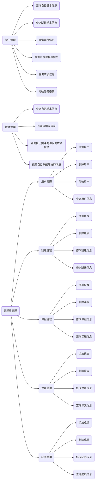

###### 遵循Java Web应用系统的分层模型与面向接口编程的基本思想,应用SSM框架，开发一个学生信息管理系统。

**二、考核内容：**

| 序号 | 考核内容                                       | 分值 | 得分 |
|----|--------------------------------------------|----|----|
| 一  | 前台学生用户功能                                   | 20 |    |
| 二  | 后台管理用户功能                                   | 50 |    |
| 三  | 系统界面是否简洁美观，布局合理协调，操作方便友好                   | 15 |    |
| 四  | 系统报告文档是否涵盖系统功能需求分析，系统模块设计，系统实现，技术分析，总结等内容。 | 15 |    |

**三、系统功能要求**

系统信息包括：

> 用户信息（用户名，密码，用户类别）
>
> 学生基本信息（学号，姓名，性别，出生日期，专业，班级，家庭住址，联系电话，备注）
>
> 班级基本信息（班级名称，专业，班级人数，入学年份，辅导员）
>
> 课程信息（课程号，课程名，学时，学分）
>
> 课程表信息（排课ID，课程号，班级号，授课教师，授课时间，授课地点）
>
> 成绩表（学号，课程号，分数）
>
> 教师表（工号，姓名，性别，出生日期，院系，联系电话）

用户：学生、教师和管理员3种类型。

### 学生功能：

- [x] 查询自己基本信息

- [ ] 查询自己班级基本信息

- [ ] 查询课程信息

- [ ] 查询自己班级课程表信息

- [x] 查询自己的成绩信息

- [ ] 对自己的登录密码进行修改。

### 教师功能：

- [x] 查询教师自己的基本信息
- [ ] 查询自己的课程表信息
- [x] 查询自己授课的课程的成绩信息
- [ ] 提交自己教授课程的成绩

### 管理员功能：

- [ ] 用户管理、学生信息管理、班级信息管理、课程信息管理、课程表信息管理、成绩信息管理：对所有信息进行添加、删除、修改、查询。

> 管理员能查询所有表的所有信息，也能根据搜索框提交的关键字搜索对应信息。

#### 学生基本信息查询：

- [ ] 根据学号查询、姓名查询某个学生信息

- [ ] 根据专业、班级查询某个专业、班级所有学生信息。

### 班级基本信息查询：

- [x] 根据班级名称查询、根据专业查询、根据入学年份查找班级信息。

### 课程信息查询：

- [ ] 根据课程号、课程名查询课程信息。

### 课表信息查询：

- [x] 根据课程号、课程名查询、教师进行查询、能根据时间进行查询。

### 成绩查询：

- [x] 按照学号查询某个学生的全部成绩

- [x] 根据课程号查询某门课程的成绩
- [x] 能按照成绩区间查找成绩，比如说查询不及格的学生或者90分以上的学生及课程。

### 排课控制：

一名教师不能同时给两个班级上课，一个班不能同时上两门课，一个教室不能同时排两门课

**四、注意事项：**

（1）压缩文件用学号及姓名进行命名，如：“0203017141001张三.rar”；

（2）作品要有原创性、实用性和科学性，不能抄袭，如作品中有侵权行为，本课程总成绩记为0分。

（1）分开上交系统压缩文件和系统报告文档，系统压缩文件中应该有该系统数据库导出的文件*.sql文件，压缩文件和文档均用学号及姓名进行命名；

（2）作品要有原创性、实用性和科学性，不能抄袭，如作品中有侵权行为，本课程总成绩记为0分。
